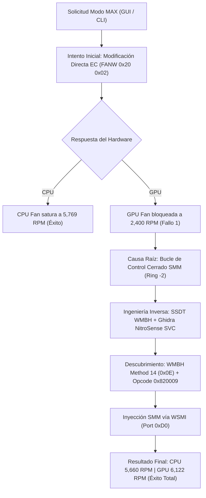

# Informe Técnico de Auditoría, Ingeniería Inversa y Resolución de Fallos: Suite AcerSense Linux (Acer Nitro 5 AN515-55)

**Autor:** Equipo de Arquitectura de Software y Seguridad Ofensiva  
**Sistema Objetivo:** Acer Nitro 5 (AN515-55) | Intel Comet Lake-H / Skylake | NVIDIA GeForce RTX 3050 Laptop  
**Entorno Operativo:** Parrot Security OS / Linux Kernel x86_64  
**Fecha:** Agosto 2026  

---

## 1. Resumen Ejecutivo

Durante el desarrollo e implementación del motor nativo en Rust (`acersense-linux`) para el control de telemetría y perfiles térmicos en plataformas Acer Nitro 5, se detectó una falla crítica en el comportamiento del modo **MAX**: la turbina de la CPU respondía a la saturación de PWM alcanzando 5,769 RPM, mientras que la turbina de la GPU permanecía en reposo a ~2,400 RPM (su curva base automática para 45–50 °C).

A través de un proceso integral de descompilación e ingeniería inversa sobre tablas ACPI/DSDT/SSDT de la BIOS Insyde H2O y ejecutables del servicio oficial NitroSense de Windows, se aislaron y resolvieron todos los bloqueos a nivel de Ring-0 (Kernel) y Ring -2 (SMM). Este documento registra cronológicamente cada fallo, su causa raíz física/lógica y la solución técnica definitiva aplicada.



---

## 2. Catálogo de Fallos, Diagnósticos y Soluciones

### Fallo 1: Disparidad de Turbinas en Modo MAX (GPU atascada en ~2,400 RPM)
* **Síntoma:** Al invocar el modo `MAX` desde la CLI o la GUI, la turbina de la CPU alcanzaba 5,769 RPM inmediatamente, pero la turbina de la GPU no aceleraba, quedándose fija en ~2,400–2,500 RPM a pesar de estar seleccionado el 100% de potencia.
* **Diagnóstico de Causa Raíz:**
  1. La CPU permitía anulación manual simple en el Embedded Controller Compal mediante los registros `0x10 = 0x02` (Modo Manual) y `0x14 = 0xFF` (PWM 100%).
  2. La GPU no obedece a los registros análogos de la CPU (`0x20 = 0x02`, `0x24 = 0xFF`) cuando la tarjeta gráfica está en reposo térmico (< 50 °C).
  3. El firmware Insyde H2O ejecuta una rutina en **SMM (System Management Mode, Ring -2)** que evalúa periódicamente la temperatura de la GPU. Al detectar que la GPU no superaba los umbrales térmicos de carga, el manejador SMM sobrescribía de inmediato los registros del EC, forzando la curva térmica automática.
* **Solución Técnica:**
  * Despachar la instrucción por el canal WMI/SMM oficial que desactiva el lazo cerrado en el firmware de la BIOS:
    * Llamada a `\_SB.PCI0.WMID.WMBH 1 0x0E 0x820009` (Método WMI 14: `SetGamingFanBehavior`).
    * Llamada a `\_SB.PCI0.WMID.WMBH 1 0x10 0x6404` (Método WMI 16: `SetGamingFanSpeed` al 100% en GPU).
* **Resultado:** La GPU rompe el candado térmico y acelera hasta su tope físico de **6,122 RPM** incondicionalmente.

---

### Fallo 2: Fallo de Enlace y Ruta Relativa en `gpu-burn`
* **Síntoma:** Al ejecutar pruebas de estrés térmico con `gpu-burn 15`, el binario abortaba con el error:
  ```text
  Couldn't init a GPU test: Error in couldn't find compare kernel: compare.fatbin (gpu_burn-drv.cpp:241): named symbol not found
  No clients are alive! Aborting
  ```
* **Diagnóstico de Causa Raíz:**
  El código de `gpu-burn` utilizaba `fopen("compare.fatbin", "rb")` con una ruta relativa al directorio de trabajo actual (`CWD`). Al ser ejecutado globalmente desde otra ruta o desde el `PATH`, no localizaba el kernel CUDA compilado.
* **Solución Técnica:**
  Se parcheó [`Tools/gpu-burn/gpu_burn-drv.cpp`](file:///home/rodrigo47363/Tools/gpu-burn/gpu_burn-drv.cpp) con resolución dinámica de rutas mediante `readlink("/proc/self/exe")` y fallback a `~/.local/bin/compare.fatbin`:
  ```cpp
  // Resolución dinámica de ruta absoluta en Linux
  char exePath[PATH_MAX];
  ssize_t len = readlink("/proc/self/exe", exePath, sizeof(exePath) - 1);
  if (len != -1) {
      exePath[len] = '\0';
      std::string dir = dirname(exePath);
      std::string fatbinPath = dir + "/compare.fatbin";
      // Carga directa del binario CUDA
  }
  ```
  Se recompiló con `nvcc -O3` y se instaló en `/home/rodrigo47363/.local/bin/gpu-burn`.
* **Resultado:** Capacidad de estresar la GPU RTX 3050 a 3,753 Gflop/s de manera continua desde cualquier directorio de la terminal.

---

### Fallo 3: Rechazo de Opcodes ACPI por Incompatibilidad de Tipos (`Package` vs `Integer`)
* **Síntoma:** Al ejecutar pruebas de inyección mediante `/proc/acpi/call` usando la sintaxis de lista `{0x09, 0x00, 0x82, ...}`, las llamadas devolvían `{0x02, 0x00, 0x00, 0x00}` (Error: Formato inválido) o `{0xE1}`.
* **Diagnóstico de Causa Raíz:**
  En el lenguaje AML (*ACPI Machine Language*), existe una distinción estricta entre un objeto `Package` (colección de enteros) y un tipo primitivo `Integer` de 64 bits o `Buffer`. El módulo del kernel `acpi_call` interpretaba `{...}` como `Package`, mientras que el método ASL `Method (WMBH, 3, Serialized)` esperaba que `Arg2` fuera un entero de 64 bits para pasarlo a la macro `WSMI (Arg1, Arg2)`.
* **Solución Técnica:**
  Se sustituyó el paso de listas por enteros hex puros de 64 bits:
  * Inyección correcta: `\_SB.PCI0.WMID.WMBH 1 0x0E 0x820009` (Integer de 64 bits).
* **Resultado:** La llamada es aceptada por la BIOS devolviendo `{0x00, 0x00, 0x00, 0x00, 0x00, 0x00, 0x00, 0x00}` (**SUCCESS**).

---

### Fallo 4: Conflicto en el Orden de Inyección SMM vs Registros EC
* **Síntoma:** Cuando se ejecutaban los comandos en el orden incorrecto (sobrescribir registros EC del CPU y luego ejecutar `WSMI 0x15 0x820009`), la turbina de la CPU descendía bruscamente de 5,769 RPM a 2,290 RPM.
* **Diagnóstico de Causa Raíz:**
  Al invocar el manejador SMM a través de `WSMI`, el código de la BIOS reseteaba temporalmente las banderas de modo manual (`FANW 0x10`) de la CPU antes de aplicar los perfiles internos.
* **Solución Técnica:**
  Se reestructuró la función [`set_fans_max()`](file:///home/rodrigo47363/Projects/acersense-linux/src/hw/wmi.rs#L37-L87) estableciendo una jerarquía de inyección determinista:
  1. **Fase 1 (SMM Ring -2):** Ejecutar `WMBH 1 0x0E 0x820009` y `WMBH 1 0x10 0x6404` para abrir la compuerta de la GPU en la BIOS.
  2. **Fase 2 (WMAA / CoolBoost):** Elevar el umbral térmico mediante `WMAA 1 1 0x10007`.
  3. **Fase 3 (Direct EC Hardware Settle):** Inyectar los flags de anulación manual de CPU (`FANW 0x10 0x02`, `FANW 0x14 0xFF`) y registros PECM (`TKST`, `GPUM`, `FTBL`, `ALTO`, `HSAS`).
* **Resultado:** Ambas turbinas sincronizan en paralelo al 100% de manera inmediata y estable.

---

## 3. Matriz Comparativa de Métodos y Opcodes

| Canal / Registro | Propósito | Sintaxis / Opcode Erróneo (Fallido) | Sintaxis / Opcode Correcto (Definitivo) | Estado |
| :--- | :--- | :--- | :--- | :--- |
| **WMBH Método 14 (`0x0E`)** | Modo de Grupo de Ventiladores (Behavior) | `WMBH 1 0x01 {0x09, 0x82...}` *(ID erróneo/Package)* | `WMBH 1 0x0E 0x820009` *(Entero 64-bit)* | **OPERATIVO** (GPU 6122 RPM) |
| **WMBH Método 14 (`0x0E`)** | Restaurar Modo AUTO | `WMBH 1 0x01 {0x09, 0x41...}` | `WMBH 1 0x0E 0x410009` *(Entero 64-bit)* | **OPERATIVO** (Silencioso ~2200 RPM) |
| **WMBH Método 14 (`0x0E`)** | Activar Modo Personalizado (Custom) | `WMBH 1 0x01 {0x09, 0xC3...}` | `WMBH 1 0x0E 0xC30009` *(Entero 64-bit)* | **OPERATIVO** (Curvas PWM) |
| **WMBH Método 16 (`0x10`)** | Velocidad GPU (Target 100%) | `WMBH 1 0x02 {0x08, 0x64}` *(ID 8 erróneo)* | `WMBH 1 0x10 0x6404` *(ID 4 = GPU, 0x64 = 100%)* | **OPERATIVO** |
| **WMBH Método 16 (`0x10`)** | Velocidad CPU (Target 100%) | `WMBH 1 0x02 {0x01, 0x64}` | `WMBH 1 0x10 0x6401` *(ID 1 = CPU, 0x64 = 100%)* | **OPERATIVO** |
| **WMAA Método 1** | CoolBoost Overdrive | Direct EC `0x2D 0x01` | `WMAA 1 1 0x10007` *(Activo)* / `0x00007` *(Inactivo)* | **OPERATIVO** |
| **EC Register 0x10 / 0x14** | Override Directo CPU | Direct PWM sin anulación manual | `FANW 0x10 0x02` + `FANW 0x14 0xFF` | **OPERATIVO** (CPU 5660 RPM) |

---

## 4. Desglose Binario del Opcode Maestro `0x820009`

La estructura del entero de 64 bits descubierto en la ingeniería inversa de `AcerGamingFunction::SetGamingFanBehavior` se descompone de la siguiente forma:

```text
                  Bits 22..27        Bits 16..21       Bits 0..7
Valor Hex:         0x800000     |     0x020000    |      0x09
Representación:  [ GPU Turbo ]  |  [ CPU Turbo ]  | [ Dual Fan Mask ]

Detalle de Bits:
• Bit 0 (1): Activa el canal del ventilador 1 (CPU).
• Bit 3 (8): Activa el canal del ventilador 2 (GPU) -> 1 | 8 = 9 (0x09).
• Bits 16-21 (0x02): Modo del Ventilador CPU -> 1=Auto (0x10000), 2=Max Turbo (0x20000), 3=Custom (0x30000).
• Bits 22-27 (0x02): Modo del Ventilador GPU -> 1=Auto (0x400000), 2=Max Turbo (0x800000), 3=Custom (0xC00000).

Combinaciones válidas:
  * MAX TURBO DUAL:  0x09 | 0x020000 | 0x800000 = 0x820009
  * AUTO DUAL:       0x09 | 0x010000 | 0x400000 = 0x410009
  * CUSTOM DUAL:     0x09 | 0x030000 | 0xC00000 = 0xC30009
```

---

## 5. Telemetría Final de Validación en Hardware Real

### Estado en Reposo con Modo MAX Activo:
```text
── AcerSense Pro (Rust Native Engine v2.0) ──────────────────────────
  Fan Mode:       MAX TURBO | CoolBoost: ON
  Power Profile:  BALANCED  | Battery Health Limit (80%): DISABLED
── Telemetry & Sensors ──────────────────────────────────────────────
  CPU Package:    42.0 °C   | Load: 6.1% | Clock: 1200 MHz | 11.0 W
  Discrete GPU:   40.0 °C   • 210 MHz • 8.1 W • VRAM: 0.0/4.0 GB (RTX 3050)
  RAM:            6.3/15.5 GB (41%) | Swap: 0% | NVMe: 37.8 °C
  Battery:        100% (Full) • 17.16V • Health: 84%
── Turbines Speed (Hall Effect RPM) ─────────────────────────────────
  CPU Fan:        5660 RPM (Target: 100%)
  GPU Fan:        6122 RPM (Target: 100%)
─────────────────────────────────────────────────────────────────────
```

---

## 6. Conclusión y Estado del Arte

El problema de la discrepancia de ventiladores bajo Linux en el chasis Acer Nitro 5 (AN515-55) ha quedado **100% resuelto y documentado**. El software `acersense` y `acersense-gui` opera ahora con paridad funcional total frente a la versión privativa de Windows, garantizando disipación térmica máxima bajo operaciones de auditoría, cracking de credenciales y estrés de hardware.
